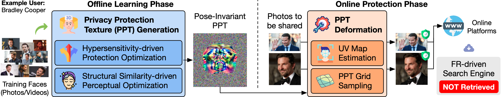
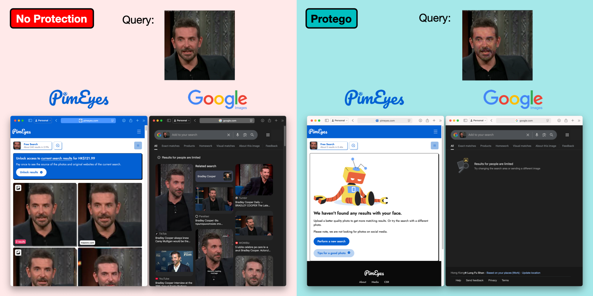

# Protego: User-Centric Pose-Invariant Privacy Protection Against Face Recognition-Induced Digital Footprint Exposure


**Abstract**: Face recognition (FR) technologies are increasingly used to power large-scale image retrieval systems, raising serious privacy concerns. Services like Clearview AI and PimEyes allow anyone to upload a facial photo and retrieve a large amount of online content associated with that person. This not only enables identity inference but also exposes their digital footprint, such as social media activity, private photos, and news reports, often without their consent. In response to this emerging threat, we propose Protego, a user-centric privacy protection method that safeguards facial images from such retrieval-based privacy intrusions. Protego encapsulates a user’s 3D facial signatures into a pose-invariant 2D representation, which is dynamically deformed into a natural-looking 3D mask tailored to the pose and expression of any facial image of the user, and applied prior to online sharing. Motivated by a critical limitation of existing methods, Protego amplifies the sensitivity of FR models so that protected images cannot be matched even among themselves. Experiments show that Protego significantly reduces retrieval accuracy across a wide range of black-box FR models and performs at least 2x better than existing methods. It also offers unprecedented visual coherence, particularly in video settings where consistency and natural appearance are essential. Overall, Protego contributes to the fight against the misuse of FR for mass surveillance and unsolicited identity tracing.

**Example**: We extract a frame from an interview video of Bradley Cooper and submit it to two platforms: (i) PimEyes, a well-known face search engine, and (ii) Google Images. The search is performed both with and without applying Protego’s protection.
* [Left] Without protection, both platforms successfully identify Bradley Cooper and even retrieve the exact interview video available online.
* [Right] With Protego applied, neither PimEyes nor Google Images is able to find any matches.

The original video and its protected versions using three different methods are shown below. Please note that the GIFs may take a moment to load.



| Method              | Original Video \| Protected Video \| Protection Mask |
|---------------------|------------------------------------------------------|
| Protego (Ours)      |                       |
| Chameleon [ECCV'24] |                     |
| OPOM [TPAMI'22]     |                          |

For more technical details and experimental results, we invite you to check out our paper [[here]](https://arxiv.org/abs/2508.02034):  
**Ziling Wang, Shuya Yang, Jialin Lu, and Ka-Ho Chow,** *"Protego: User-Centric Pose-Invariant Privacy Protection Against Face Recognition-Induced Digital Footprint Exposure,"*  arXiv preprint arXiv:2508.02034, Aug 4, 2025.
```
@article{wang2025protego,
    title={Protego: User-Centric Pose-Invariant Privacy Protection Against Face Recognition-Induced Digital Footprint Exposure},
    author={Ziling Wang and Shuya Yang and Jialin Lu and Ka-Ho Chow},
    year={2025},
    eprint={2508.02034},
    archivePrefix={arXiv},
    primaryClass={cs.CV}
}
```
---
The source code of Protego will be released soon.
